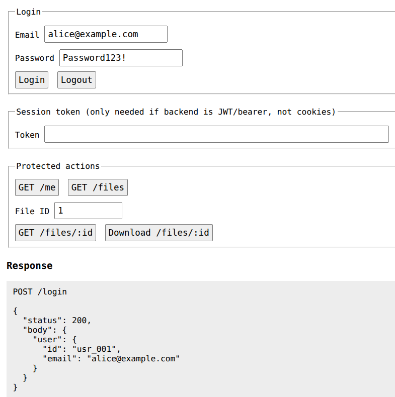
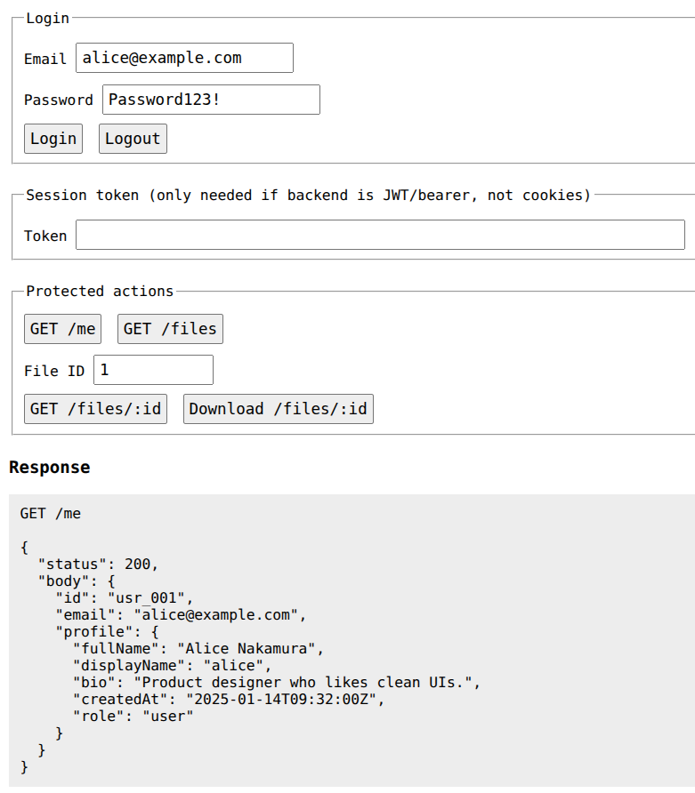
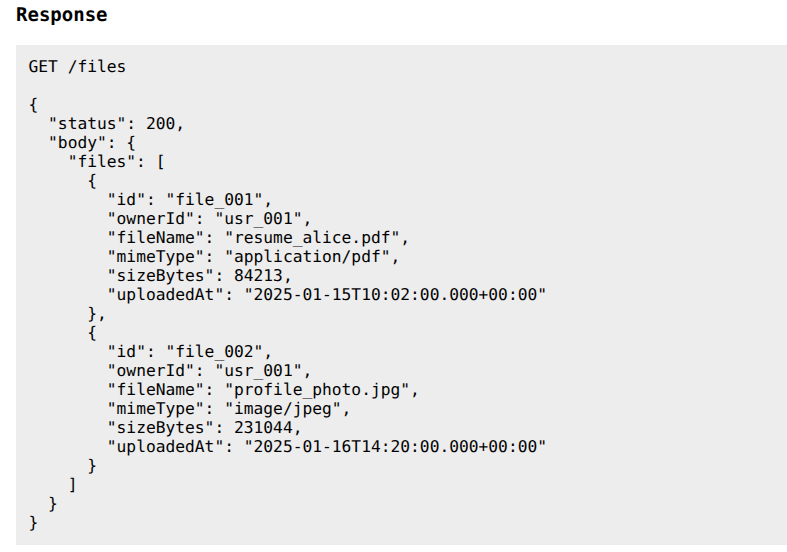
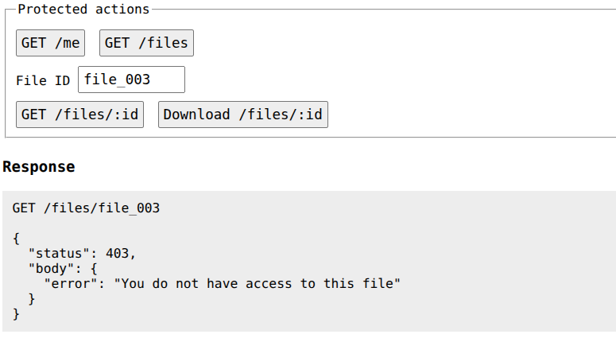
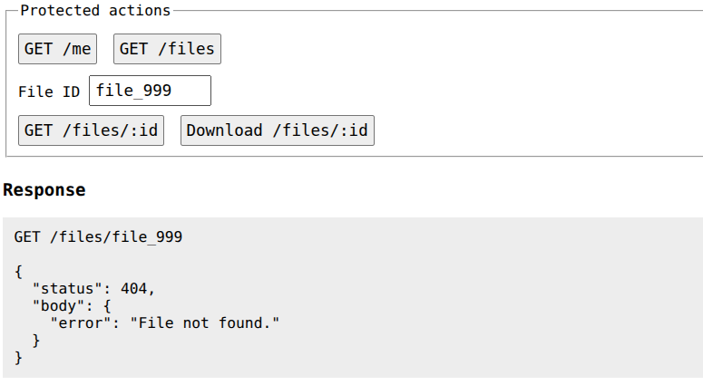
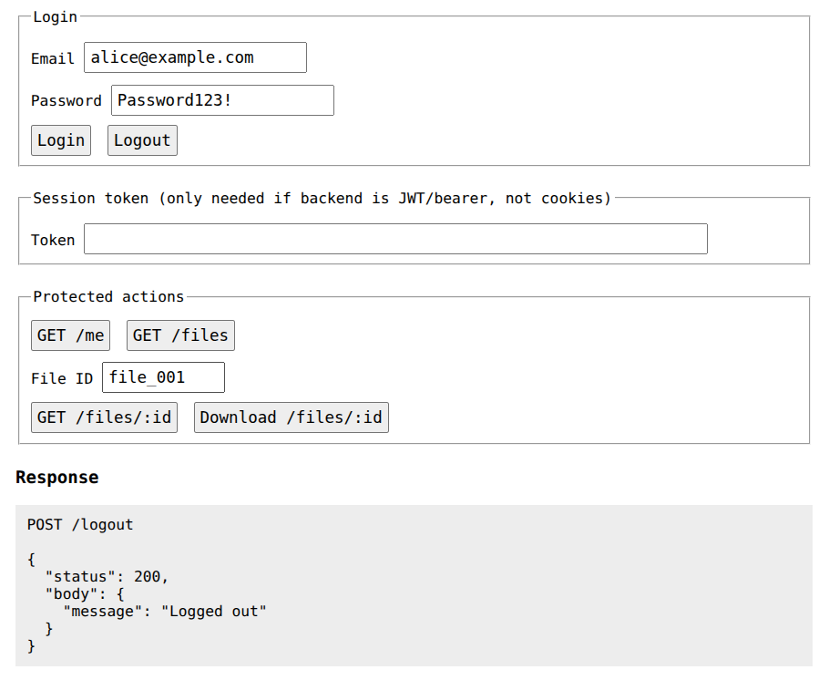
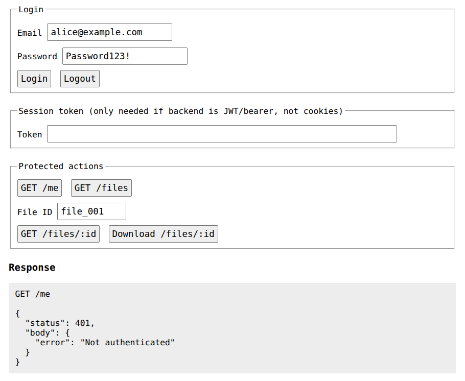
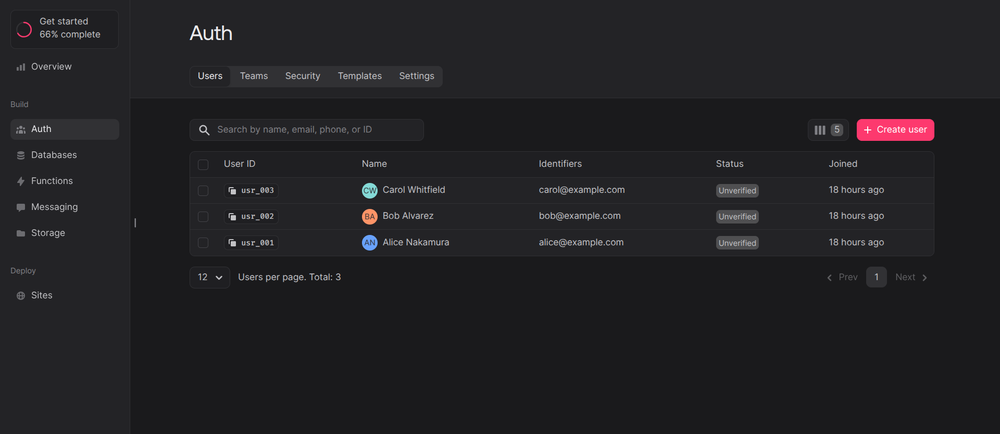
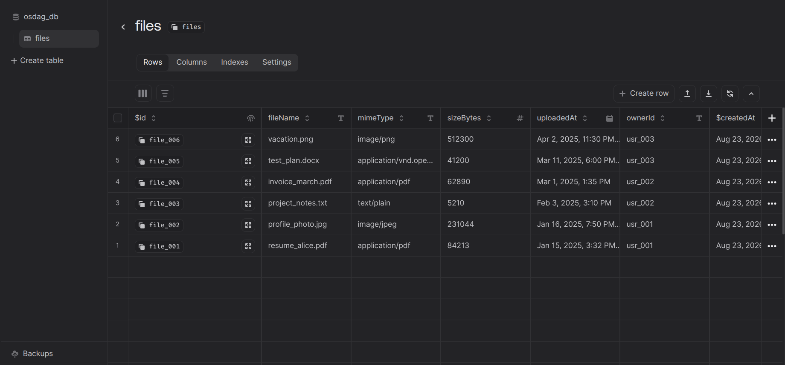
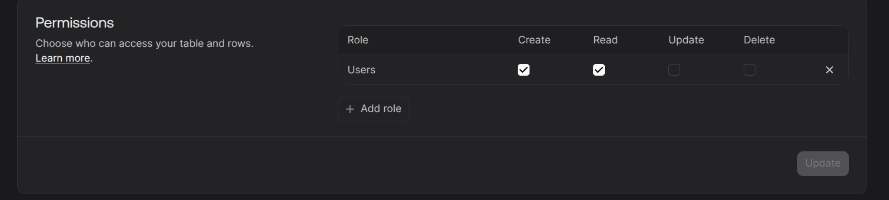

# Secure Login System with User Details & File Access (Appwrite Backend)

> FOSSEE Osdag Screening Task Implementation

**Tech Stack:** Appwrite Cloud (Backend-as-a-Service), Appwrite Web SDK v14, Node.js (Appwrite Server SDK), Vanilla JavaScript (Modular ES6 Architecture)

---

## 1. Overview

This repository contains the Managed Backend implementation of the Secure Login System for the FOSSEE Osdag screening task, built using **Appwrite Cloud**.

It provides full feature parity with the Custom REST backend, handling user registration, authentication, server-side session invalidation, user profile management, and isolated file access. The implementation interfaces directly with the provided `index.html` testing client via a modular client-side adapter (`appwrite-adapter.js`).

---

## 2. System Architecture and Design Decisions

### 2.1 Authentication & Session Management in Appwrite

Authentication is managed via Appwrite's built-in Auth service using session-based authentication:

* **Session Lifecycle:** Successful authentication via `account.createEmailPasswordSession()` creates an active session on the Appwrite server and issues a secure session token.
* **Cross-Origin Handling:** During local testing (`localhost` communicating with Appwrite Cloud), the Appwrite Web SDK manages session tokens via browser storage (`localStorage`) to avoid third-party cookie blocking. In production with a custom domain, Appwrite seamlessly utilizes first-party `httpOnly` secure cookies.
* **Server-Side Logout:** Invoking `account.deleteSession('current')` communicates directly with Appwrite's API to immediately destroy the session record on the server. Subsequent requests to protected endpoints (`GET /me`, `GET /files`) fail with `401 Not authenticated`.

### 2.2 User Data Isolation and the 403 vs. 404 Distinction

Appwrite provides native row-level security. The adapter enforces the exact task requirements as follows:

* **Profile Isolation (`GET /me`):** Calls `account.get()` and `account.getPrefs()`, retrieving solely the profile data associated with the actively authenticated session.
* **File Table Isolation (`GET /files`):** Files are queried using `Query.equal('ownerId', user.$id)`, ensuring the returned list contains only rows belonging to the logged-in user.
* **Single File Access (`GET /files/:id`):** The endpoint enforces a two-tier check to guarantee a distinct error state between non-existent files and unauthorized file access:
  1. The row is fetched from the database: `databases.getDocument(databaseId, tableId, fileId)`.
  2. If the row does not exist in the database $\rightarrow$ returns **`404 File not found`**.
  3. If the row exists but `doc.ownerId !== user.$id` $\rightarrow$ returns **`403 You do not have access to this file`**.
  4. If the row exists and `doc.ownerId === user.$id` $\rightarrow$ returns **`200 OK`**.

---

## 3. What Appwrite Handled Automatically vs. What Was Configured

### 3.1 Handled Automatically by Appwrite

* **Cryptographic Password Hashing:** User passwords are automatically hashed and salted using industry-standard algorithms (Argon2id/bcrypt) before persistence; plaintext passwords are never stored or exposed.
* **Session Store Management:** Server-side session creation, token validation, rate-limiting, and lifecycle expiration are handled natively by the Appwrite engine.
* **Brute-Force Protection:** Appwrite enforces automated rate limiting on authentication routes against repeated failed login attempts.
* **Database & Storage Engine:** Managed database tables, indexing, and storage bucket infrastructures are provided without requiring manual database administration.

### 3.2 Configured and Implemented Manually

* **Database & Table Schemas:** Created the `osdag_db` database and `files` table, defining attributes (`fileName`, `mimeType`, `sizeBytes`, `uploadedAt`, `ownerId`).
* **Row-Level Security & Role Permissions:** Configured table-level permissions (`Users` role granted `Create` and `Read`) and enabled Row Security to allow user-scoped data governance.
* **Modular Client Adapter (`src/`):** Developed a modular JavaScript adapter using ES6 modules (`config/`, `controllers/`, `routes/`) to intercept `window.fetch` requests from `index.html` and map them to Appwrite Web SDK calls.
* **Administrative Seeding Pipeline (`seed-appwrite.js`):** Developed an automated Node.js script using the Appwrite Server SDK and admin API key to seed the 3 required test users, user preferences, and file metadata with per-user read/delete permissions.
* **Error Mapping & Generic Responses:** Standardized Appwrite exceptions to match the API contract (e.g., returning generic `401 Invalid email or password` on bad credentials, and differentiating `403` vs. `404` file errors).

---

## 4. Modular Directory Structure

```text
osdag-appwrite-backend/
├── index.html                  # Provided testing client
├── appwrite-adapter.js         # Entry point: intercepts fetch and delegates to router
├── seed-appwrite.js            # Admin seeder script (Node.js SDK)
├── seed-data.json              # Seed data source
├── package.json                # Seeder dependencies
├── .env.example                # Template for Appwrite configuration
├── README.md                   # Documentation
└── src/
    ├── config/
    │   └── appwrite.js         # SDK Client, Account, Databases, and Storage initialization
    ├── controllers/
    │   ├── authController.js   # Registration, Login, Logout, and /me logic
    │   └── fileController.js   # File listing, 403/404 isolation, and download handlers
    └── routes/
        └── router.js           # Route dispatcher mapping endpoints to controllers
```

---

## 5. Seed Accounts

The seeder populates three test accounts into Appwrite Cloud:

| User | Email | Plaintext Password (for testing) | Seeded File IDs |
| --- | --- | --- | --- |
| User A | `alice@example.com` | `Password123!` | `file_001`, `file_002` |
| User B | `bob@example.com` | `Password123!` | `file_003`, `file_004` |
| User C | `carol@example.com` | `Password123!` | `file_005`, `file_006` |

---

## 6. Setup and Execution Guide

### Prerequisites

* Node.js (v18+ recommended)
* An active Appwrite Cloud account (or self-hosted Appwrite instance)

### Step 1: Clone and Configure Environment

```bash
# Clone the repository
git clone https://github.com/aranyaksamui/osdag-appwrite-backend.git
cd osdag-appwrite-backend

# Install seeder dependencies
npm install

# Create environment configuration
cp .env.example .env
```

Configure `.env` with your Appwrite project parameters:

```env
APPWRITE_ENDPOINT=https://cloud.appwrite.io/v1  # Or regional endpoint (e.g., https://sgp.cloud.appwrite.io/v1)
APPWRITE_PROJECT_ID=<APPWRITE_PROJECT_ID>
APPWRITE_API_KEY=<APPWRITE_API_KEY>
APPWRITE_DATABASE_ID=<APPWRITE_DB_NAME>
APPWRITE_TABLE_ID=files
APPWRITE_BUCKET_ID=user-files
```

### Step 2: Run the Seeding Script

Execute the administrative seeder to populate users and files into Appwrite Cloud (requires an API Key from Appwrite Cloud):

```bash
node seed-appwrite.js
```

### Step 3: Run the Testing Client

Serve the application using any local HTTP static server:

```bash
npx serve .
```

1. Open the local server URL in your browser.
2. Select **Appwrite (appwrite-adapter.js talks to Appwrite directly via its Web SDK)**.
3. Ensure the **Endpoint**, **Project ID**, **Database ID**, and **Files collection ID** match your Appwrite project configuration.
4. Use the quick-fill buttons to execute authentication, profile lookup, and file isolation tests.

---

## 7. What Would Be Improved Given More Time

1. **Custom Domain Integration:** Mapping a custom domain to the Appwrite project to allow first-party `httpOnly` cookie transmission instead of relying on `localStorage` token fallbacks.
2. **Appwrite Cloud Functions:** Implementing serverless Appwrite Functions for server-side virus scanning and automatic MIME-type validation upon file uploads.
3. **Appwrite Storage Bucket Sync:** Direct binary synchronization between the `user-files` Storage Bucket and the database table rows, generating short-lived expiring download tokens.
4. **Automated E2E Testing:** Writing automated Cypress/Playwright suites to simulate multi-user cross-account access attempts in a headless browser environment.

---

## 8. Verification Screenshots

### 8.1 Successful Authentication and Profile Retrieval (`GET /me`)

* **Login**



* **Profile retrieval**



### 8.2 File Listing (`GET /files`)



### 8.3 Data Isolation Enforcement (403 Forbidden vs. 404 Not Found)

* **Accessing Another User's File (403 Forbidden):**



* **Accessing Non-Existent File (404 Not Found):**



### 8.4 Server-Side Logout Verification (401 Unauthorized after Logout)

* **Logout**



* **Not Authenticated**



### 8.5 Appwrite Cloud Database View (Users, Files and Row Level Security View)






